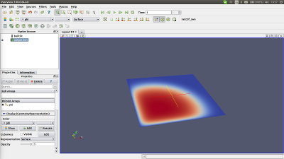

## Finite-difference solver for non-linear 2D diffusion-reaction problem

### How to build

Each of the components (serial, OpenMP, etc...) is designed to be self-contained. Building a component on a Cray system should be as simple as (assuming that either the GNU or Cray programming environment is loaded):

```
$ cd <component>
$ make
```

Build notes specific to individual components is given below where relevant

#### OpenMP component

The OpenMP Fortran component has been tested with both Cray and GNU compilers on XK7, XC30 systems. The makefil detects which programming environment is loaded, and choose appropriate flags for OpenMP (so long as either Cray or GNU environments are present).

### How to run

The application takes up to 5 parameters:

```
main nx ny nt tend verbose
```

- nx is the x dimension of the computational domain.
- ny is the y dimension of the computational domain
- nt is the number of time steps
- tend is the total length of time for the simulation
- verbose (optional) if a fifth argument is passed, verbose output will be generated. This includes information about the domain decomposition, and conjugate gradient convergence statistics at each time step.

The domain has a width of 1, reguardless of the input dimensions, so the horizontal grid spacing is _h=1/(nx+1)_. The grid spacing is the same on the x and y axis, so if a rectangular domain is chosen with _ny .ne. nx_, the vertical dimension of the domain will be _ydim=h*(ny+1)_.

The grid dimensions are important when choosing a set of parameters for running the test, because the maximum possible time step size for which the iterations will converge is dependent on the size of _h_. As the grid spacing _h_ decreases, the size of the time step also has to decrease (that is, the number of time steps has to increase). A good time scale to see something interesting happen is 0.01 seconds, so the following set of parameters are a good spot to start:
```
$ OMP_NUM_THREADS=8 aprun -cc none ./main 128 128 100 0.01
```

## Visualising the results

The application outputs the final solution in the "brick of values" format, which is stored in the two files __output.bin__ and __output.bov__. These can be viewed using the populare visualization packages Paraview and Visit. An example output in Paraview is



The visualization isn't just a pretty picture, it is very useful for debugging the code. A quick visual check can show if there are any problems with the boundary conditions, or halo exchanges for the MPI implementation. For this reason, the MPI implementations use MPI IO to output the global solution, and it is highly recommended that this feature should be used to help students implement halo exchanges.
